# 목차

# 1. 들어가며

### 1.1 프로젝트 소개

CRUD 기능을 가진 게시판을 구현하는 개인 프로젝트입니다. 학습을 위해 Lombok 미사용했으며, JPA 대신 Spring JDBC를 사용했습니다.

### 1.2 기능

- 게시판 : CRUD 기능
- 사용자 : 회원가입 및 로그인, 회원정보 수정, 프로필 조회
- 댓글 : CRUD 기능

### 1.3. 사용 기술

#### 주요 프레임 워크 / 라이브러리
- Java
- SpringBoot
- Spring JDBC
- JUnit5, AssertJ

#### Build Tool
- Gradle

#### DB
- MySQL / H2DB(Test 용)

#### Template Engine
- Mustache

#### 비동기 처리
- Jquery

#### 배포
- AWS EC2

#### CI/CD
- Linux Bash Build Script 작성
- Crontab

## 2. 서비스 미리보기

### 2.1 게시글
1. 게시글 전체 목록

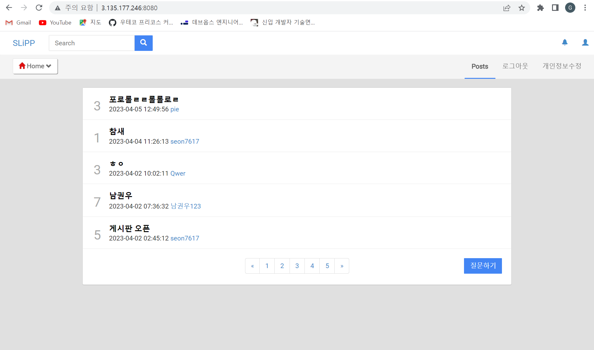

게시글의 전체 목록과 게시글의 댓글 개수가 조회됩니다.

2. 게시글 등록

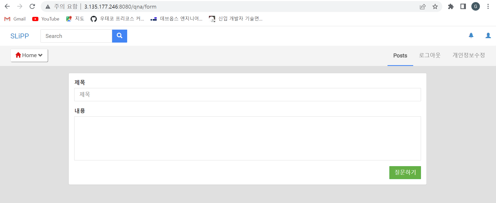

로그인한 사용자만 질문을 작성할 수 있고, 작성 후 목록으로 redirect됩니다.

3. 게시글 상세 보기

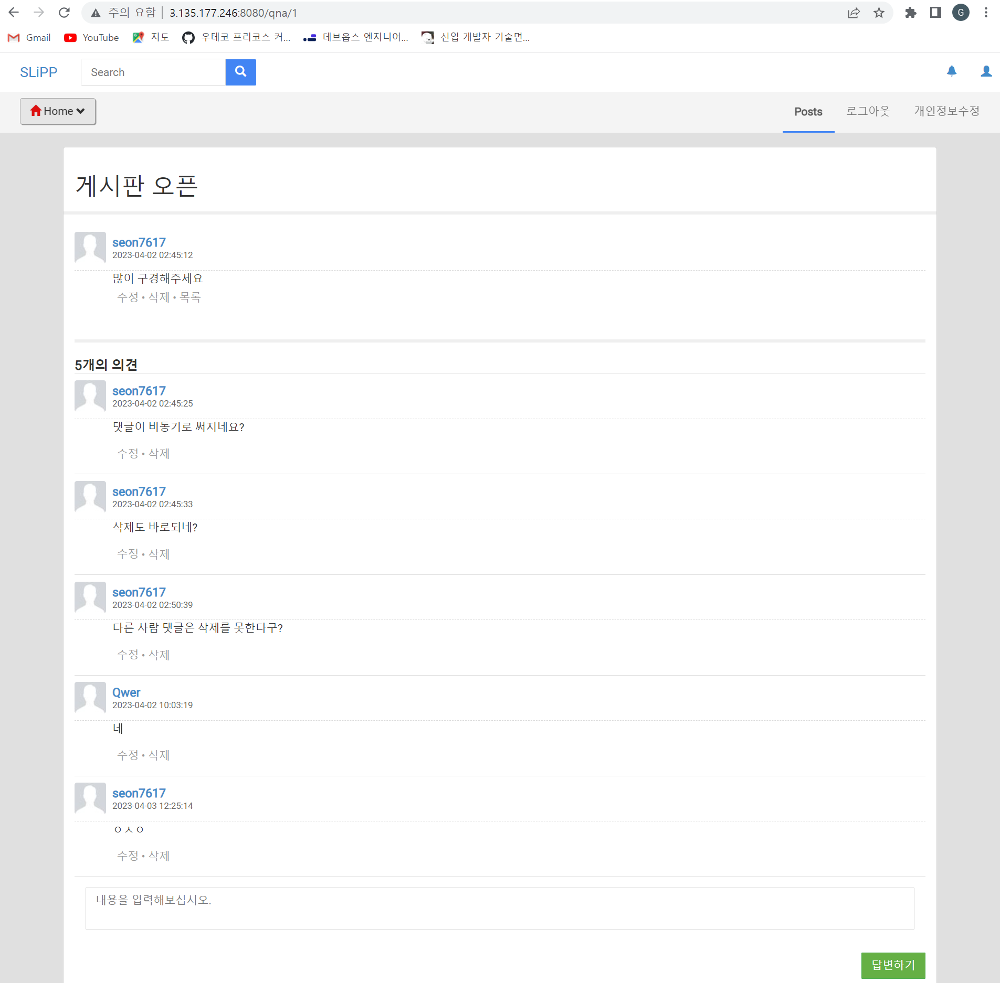

게시글 내용과 댓글을 조회할 수 있습니다.

4. 게시글 수정 하기

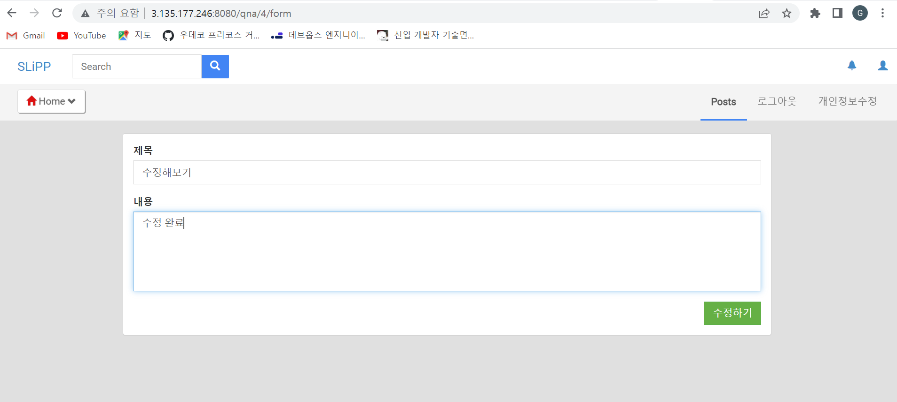

작성자만 게시글의 내용을 수정할 수 있습니다. 수정 후 게시글 목록으로 redirect됩니다.

5. 게시글 삭제 하기(Soft-delete)

작성자만 게시글을 삭제할 수 있고, 삭제 후 게시글 목록으로 redirect 됩니다.
단, 다른 사용자의 댓글이 존재하는 경우 삭제할 수 없습니다.

### 2.2 회원

1. 회원 가입 화면

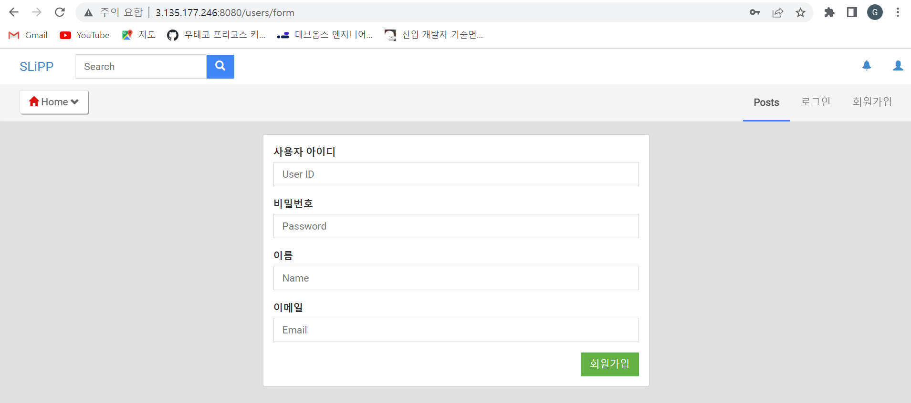

회원가입 시 유효성 검사를 진행하며, 회원 정보를 저장하고 홈 화면으로 redirect됩니다.

2. 로그인 화면

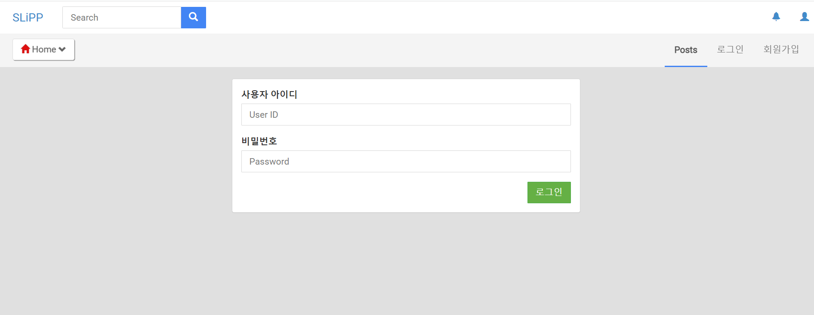

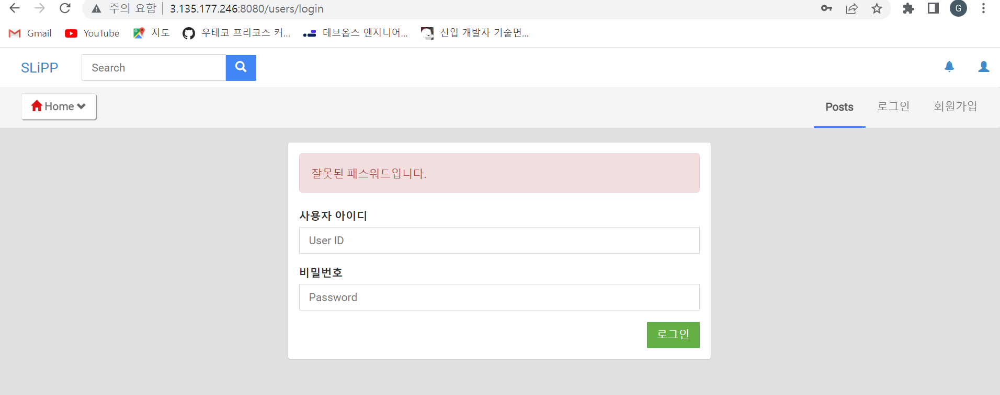
로그인 실패 시 실패 원인을 보여주는 login fail 뷰를 보여주고, 성공 시 게시글 목록으로 redirect됩니다.

3. 회원정보 수정 화면

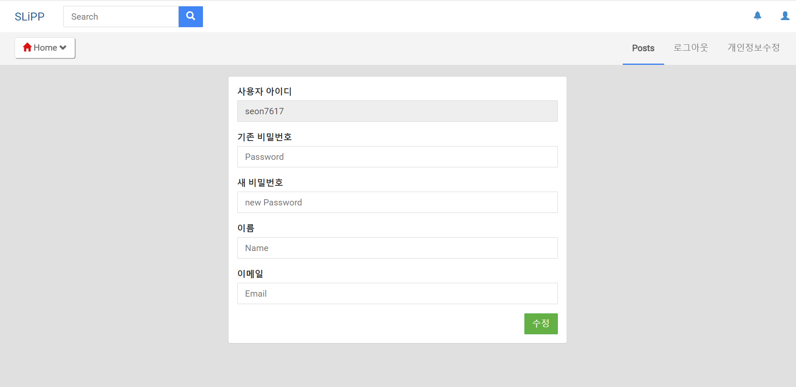

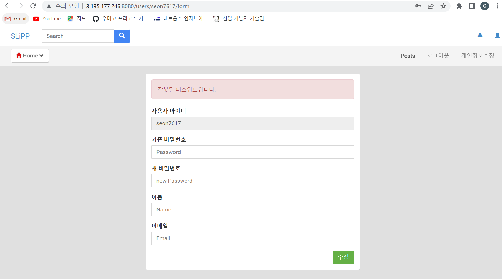

이름과 비밀번호, email을 변경할 수 있고 기존 비밀번호가 일치하지 않을 시 변경 실패 뷰를 보여주고, 성공 시 게시글 목록으로 redirect됩니다.

4. 회원정보 목록 화면

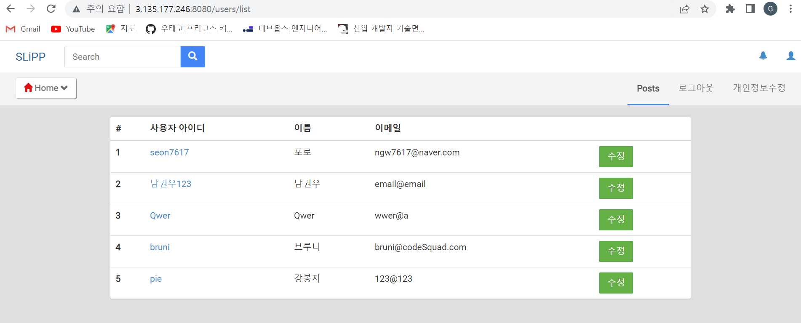

로그인 상태에서는 회원 목록을 조회할 수 있습니다. 자신의 회원 정보 수정에만 접근 가능합니다. 

### 2.3 댓글

1. 댓글 작성

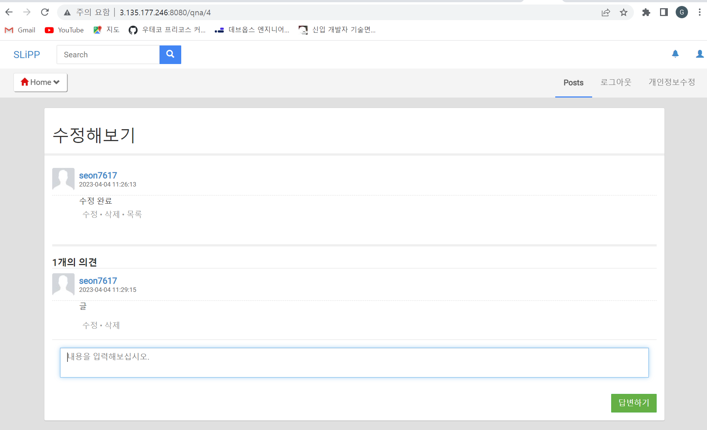

댓글은 ajax 비동기로 새로고침없이 작성됩니다.

2. 댓글 삭제(Soft-delete)

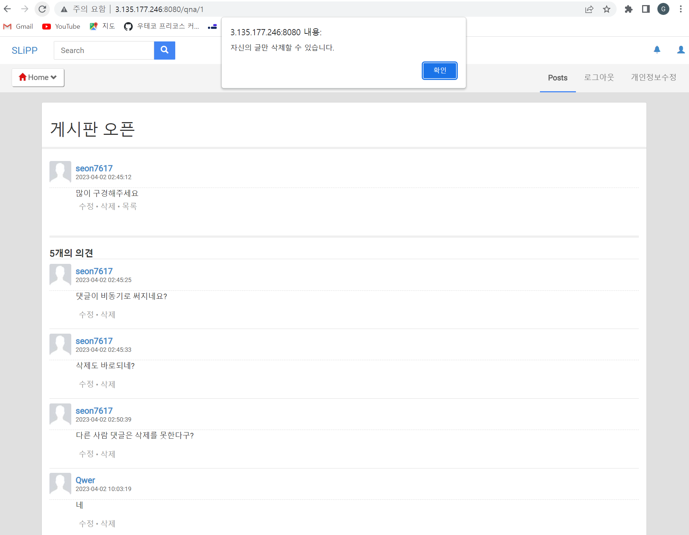

댓글은 비동기로 삭제되며 자신의 댓글만 삭제할 수 있습니다.

### 2.4 기타 예외 처리

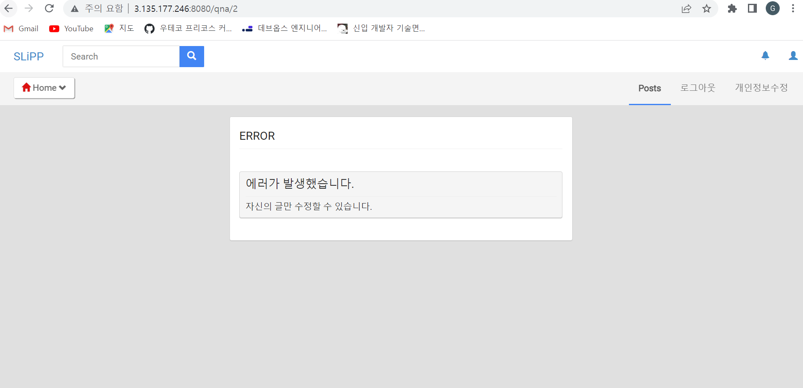
자신의 글만 삭제/수정 가능합니다.

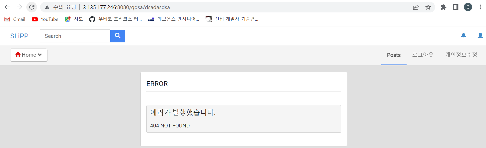
존재하지 않는 URL로 접근 시 Global Error Page에 404를 반환합니다.

## 3.설계

### 3.1 DB 설계

#### Users 테이블

| 필드 | 타입 | NULL 허용 | 키 | 기본값 |
|------|------|----------|----|--------|
| ID   | CHARACTER VARYING(255) | NO | PRI | NULL   |
| IDX  | INTEGER | NO |     | NULL   |
| PASSWORD | CHARACTER VARYING(255) | NO |   | NULL   |
| NAME | CHARACTER VARYING(255) | NO |       | NULL   |
| EMAIL | CHARACTER VARYING(255) | NO |       | NULL   |

#### Articles 테이블

| 필드 | 타입 | NULL 허용 | 키 | 기본값 |
|------|------|----------|----|--------|
| ID   | INTEGER | NO | PRI | NULL   |
| WRITER | CHARACTER VARYING(255) | NO | FK  | NULL   |
| TITLE | CHARACTER VARYING(255) | NO |     | NULL   |
| CONTENTS | CHARACTER VARYING(500) | NO |  | NULL   |
| CREATIONTIME | TIMESTAMP WITH TIME ZONE | NO | | NULL   |
| DELETED | BOOLEAN | NO | | FALSE  |

#### Replies 테이블

| 필드 | 타입 | NULL 허용 | 키 | 기본값 |
|------|------|----------|----|--------|
| ID   | INTEGER | NO | PRI | NULL   |
| WRITER | CHARACTER VARYING(255) | NO | FK  | NULL   |
| ARTICLEID | INTEGER | NO | FK  | NULL   |
| CONTENTS | CHARACTER VARYING(500) | NO | | NULL   |
| CREATIONTIME | TIMESTAMP WITH TIME ZONE | NO | | NULL   |
| DELETED | BOOLEAN | NO | | FALSE  |

### 3.2 API 설계